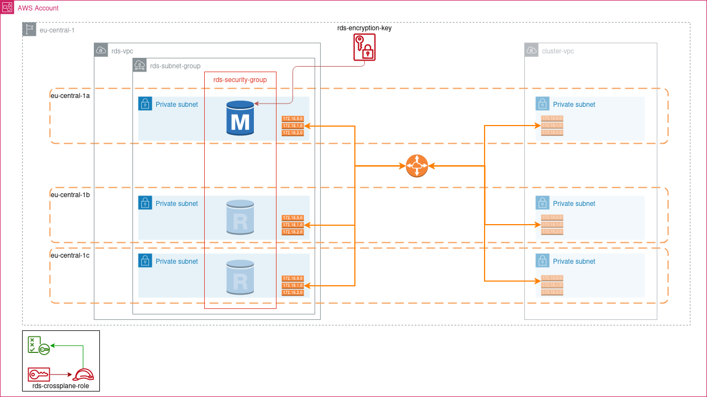

# `crossplane` PostgresDB example



In contrast to the other examples in this [AWS provider series](../), this more
complex example will build a full network hosting an Amazon Postgresql RDS
database, peered to the cluster VPC with routes between each.

The example contains three subnets, one for each availability zone, leaving
space for read replicas to be created in zones B and C although the example
does not actually implement these replicas.

## Initial setup

Before this example can be built, you must first enable crossplane AWS provider
family members and create the primary role for crossplane to assume.

In this example, we need the following provider family members enabled inside the
cluster.

- [provider-aws-ec2](https://marketplace.upbound.io/providers/upbound/provider-aws-ec2/)
- [provider-aws-rds](https://marketplace.upbound.io/providers/upbound/provider-aws-rds/)
- [provider-aws-kms](https://marketplace.upbound.io/providers/upbound/provider-aws-kms/)

To enable these, please follow the instructions in [management-cluster-bases/extras/crossplane/providers/upbound/aws](https://github.com/giantswarm/management-cluster-bases/tree/main/extras/crossplane/providers/upbound/aws)
including the instruction on [Using crossplane with IAM Roles for Service Accounts](https://github.com/giantswarm/management-cluster-bases/tree/main/extras/crossplane/providers/upbound/aws#using-crossplane-with-iam-roles-for-service-accounts)

## Create the RDS role

Once the providers have been enabled, and the primary assume role has been
created, we now need to create a second role inside the account for crossplane
to use with permissions to create and manage components inside the account.

For a detailed explanation of which permissions are required and why, please
see [this linked policy document](./policies/README.md).

### Step by step installation guide

1. Edit the file [`rds-crossplane-policy](./policies/rds-crossplane-policy.json)
   and set the variable `${AWS_ACCOUNT_ID}` to the ID of the AWS account you're
   going to use.

   ```bash
   export POLICY_NAME="rds-crossplane-policy"
   export AWS_ACCOUNT_ID=$(aws sts get-caller-identity | jq -rn .Account)

   cat ./policies/${POLICY_NAME}.json | envsubst \
       | sponge ./policies/${POLICY_NAME}.json
   ```

1. Apply this policy to AWS

   ```bash
   aws iam create-policy \
       --policy-name $POLICY_NAME \
       --policy-document file://policies/${POLICY_NAME}.json \
       --description "Custom policy for assuming roles"
   ```

1. Next, edit the trust policy and set the account ID to that of your account

   ```bash
   export TRUST_POLICY_NAME=rds-crossplane-role-trust-policy
   cat ./policies/${TRUST_POLICY_NAME}.json | envsubst \
       | sponge ./policies/${TRUST_POLICY_NAME}.json
   ```

1. Finally create the role and attach the policy to it.

   ```bash
   ROLE_NAME=rds-crossplane-role
   aws iam create-role --role-name ${ROLE_NAME} \
       --policy-document file://policies/${TRUST_POLICY_NAME}.json
   aws iam attach-role-policy --policy-arn \
      "arn:aws:iam::aws:policy/${POLICY_NAME}" \
      --role-name ${ROLE_NAME}
   ```

## Installing the database

Once our providers are installed, we are able to apply the files necessary for
building our database.

1. Create a secret for the database

   Before we can create the database, we need to create a secret for the
   database that we can use to connect to it.

   ```bash
   kubectl create secret generic -n default aws-rds-db-pass \
     --from-literal=database-password=$(pwgen -sn 20 1)
   ```

1. Apply the contents of the `xrd` folder.

   Inside the `xrd` folder, we define the [`Composition`](./xrd/composition.yaml)
   and [`Definition`](./xrd/definition.yaml) of our database, including all the
   network components we need for our database to be reachable from the cluster
   VPC.

   These must be applied before we can make a claim against them.

   ```bash
   kubectl apply -f xrd
   ```

1. Prepare and apply provider config

   The file [`providerconfig.yaml`](./providerconfig.yaml) contains the
   instruction between the provider your composition. This needs to have the
   account ID injected into it and then be applied to the cluster.

   ```bash
   export AWS_ACCOUNT_ID=$(aws sts get-caller-identity | jq -rn .Account)
   cat providerconfig.yaml | envsubst | kubectl apply -f -
   ```

   In this file, we need to define two sets of credentials. The first is the
   `WebIdentityAssumeRole`. If you followed the instructions in
   [`management-cluster-bases`](https://github.com/giantswarm/management-cluster-bases/blob/update-provider-doc/extras/crossplane/providers/upbound/aws/setting-up-irsa.md)
   then the name of this role should be `crossplane-assume-role` however your
   installation may differ if you chose another name for the primary role.

   Although we've already applied the primary role to the pod service account,
   we also need to instruct crossplane that it's to use it as its primary login
   and we do this under the `credentials` property.

   The role listed under `assumeRoleChain` must be the one that we specify when
   [creating the rds role](#create-the-rds-role).

1. Edit [`claim.yaml`](./claim.yaml)

   The file `claim.yaml` contains the defined values for our database and the
   cluster VPC we need to connect back to. Many of the values in this file are
   already set with (reasonably) sensible defaults whilst others are masked out
   with "PATCHED BY KUSTOMIZE"

   Fill out any values you need to change, refer to the [`definition.yaml`](./xrd/definition.yaml)
   if you're unsure of the meaning of any value.

    Once you're happy with the results, we can apply this to the cluster with

    ```bash
    kubectl apply -f claim.yaml
    ```

It will take about 5 - 10 minutes for the database to build. Go get yourself a
coffee, then when you check back, we should be able to connect to the database.

## Testing

1. Apply the test pod file [`pgclient.yaml`](./pgclient.yaml)

   ```bash
   kubectl apply -f ./pgclient.yaml
   ```

2. Connect to the database

   ```bash
   DB_USR=$(yq -M .spec.parameters.db.admin claim.yaml)
   DB_PASS=$(kubectl -n default get secret backstage-db-pass -o yaml | yq '.data.database-password | @base64d')
   DB_SVR=$(kubectl -n default get instances.rds.aws.upbound.io -o yaml | yq -M .items[0].status.atProvider.address)
   DB=$(yq -M .spec.parameters.db.name claim.yaml)
   kubectl -n default exec -it postgresql-client -- psql postgresql://${DB_USR}:${DB_PASS}@${DB_SVR}.:5432/${DB}?sslmode=require

   psql (14.5, server 14.7)
   SSL connection (protocol: TLSv1.2, cipher: ECDHE-RSA-AES256-GCM-SHA384, bits: 256, compression: off)
   Type "help" for help.

   myapp=>
   ```
